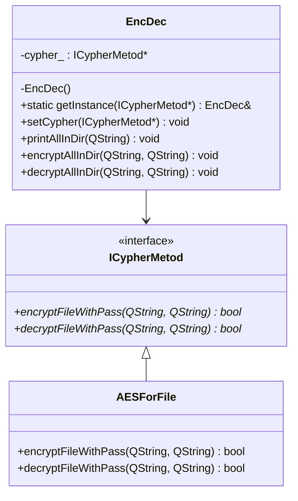

# Qt_Lab1
# Разработка средств защиты информации. Лабораторная работа №1
## 
> **Селезнев Илья Дмитриевич** группа 932223

## Постановка задачи

## Решение
### UML-диаграмма классов

```mermaid
classDiagram
    class ICypherMetod {
        <<interface>>
        +encryptFileWithPass(QString, QString) bool*
        +decryptFileWithPass(QString, QString) bool*
    }
    class AESForFile {
        +encryptFileWithPass(QString, QString) bool
        +decryptFileWithPass(QString, QString) bool
    }

    class EncDec {
        -cypher_ : ICypherMetod&#42 
        -EncDec()
        +static getInstance(ICypherMetod*) EncDec&
        +setCypher(ICypherMetod*) void
        +printAllInDir(QString) void
        +encryptAllInDir(QString, QString) void
        +decryptAllInDir(QString, QString) void
    }

    ICypherMetod <|-- AESForFile
    EncDec --> ICypherMetod
```