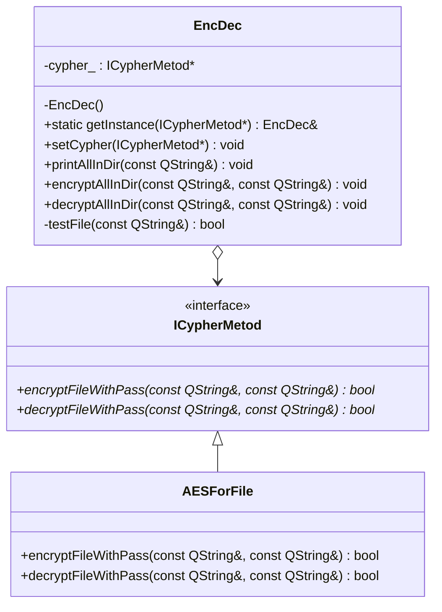

# Qt_Lab1
# Разработка средств защиты информации. Лабораторная работа №1
## 
> **Селезнев Илья Дмитриевич** группа 932223

## Постановка задачи
Реализовать защиту данных пользовательских папок и файлов, находящихся в папке, а также подпапках путем шифрования. 
Для доступа к данным исходной папке необходимо выполнить дешифрование.

## Решение
### UML-диаграмма классов

## Тестирование
### TestCases:
#### Case №1
Проверка шифрования при корректных параметрах запуска без вложенности
* Входные параметры: папка с не зашифрованными файлами без подпапок
    * Шаг 0 - запустить программу в режиме encrypt / enc
    * Шаг 1 - ввести путь до папки
    * Шаг 2 - ввести пароль "qwerty"
* Результат: файлы в папке будут зашифрованы

#### Case №2
Проверка корректного дешифрования файлов без вложенности
* Входные параметры: папка с зашифрованными файлами с предыдущего кейса
    * Шаг 0 - запустить программу в режиме decrypt / dec
    * Шаг 1 - ввести путь до папки
    * Шаг 2 - ввести пароль "qwerty"
* Результат: файлы в папке будет дешифрованы и аналогичны состоянию до шифрования

#### Case №3
Проверка шифрования при корректных параметрах запуска со вложенностями
* Входные параметры: папка с подпапками, содержащие не зашифрованные файлы
    * Шаг 0 - запустить программу в режиме encrypt / enc
    * Шаг 1 - ввести путь до папки
    * Шаг 2 - ввести пароль "qwerty"
* Результат: файлы в папках будут зашифрованы

#### Case №4
Проверка корректного дешифрования файлов со вложенностями
* Входные параметры: папка с подпапками, содержащая зашифрованные файлы с предыдущего кейса
    * Шаг 0 - запустить программу в режиме decrypt / dec
    * Шаг 1 - ввести путь до папки
    * Шаг 2 - ввести пароль "qwerty"
* Результат: файлы в папке будет дешифрованы и аналогичны состоянию до шифрования

#### Case №5
Проверка, что файл не подвергается повторному шифрованию
* Входные параметры: папка с не зашифрованным файлом
    * Шаг 0 - запустить программу в режиме encrypt / enc
    * Шаг 1 - ввести пароль "qwerty"
    * Шаг 2 - запустить программу в режиме encrypt / enc
    * Шаг 3 - ввести пароль "qwerty"
* Результат: файл в папке будет зашифрован, при повторном шифрования будет выведено File is already encrypted ...

#### Case №6
Проверка, что файл не может быть дешифрован, если он не был зашифрован
* Входные параметры: папка с не зашифрованным файлом
    * Шаг 0 - запустить программу в режиме decrypt / dec
    * Шаг 1 - ввести путь до папки
    * Шаг 2 - ввести пароль "qwerty"
* Результат: файл в папке не изменился, при дешифровании будет выведено  File is not encrypted ...

#### Case №7
Проверка корректной работы при не существующей директории
##### 7.1
* Входные параметры: не существующая директория
    * Шаг 0 - запустить программу в режиме encrypt / enc
    * Шаг 1 - ввести путь до папки
    * Шаг 2 - ввести пароль "qwerty"
* Результат: программа выведет сообщение "Directory not found." и завершит исполнение
##### 7.2
* Входные параметры: не существующая директория
    * Шаг 0 - запустить программу в режиме decrypt / dec
    * Шаг 1 - ввести путь до папки
    * Шаг 2 - ввести пароль "qwerty"
* Результат: программа выведет сообщение "Directory not found." и завершит исполнение

#### Case №8
Проверка пропуска нешифруемых файлов (символических ссылок, системных файлов, скрытых файлов)
* Входные параметры: папка с разными типами файлов
    * Шаг 0 - запустить программу в режиме encrypt / enc
    * Шаг 1 - ввести путь до папки
    * Шаг 2 - ввести пароль "qwerty"
* Результат: нешифруемые файлы были пропущены

